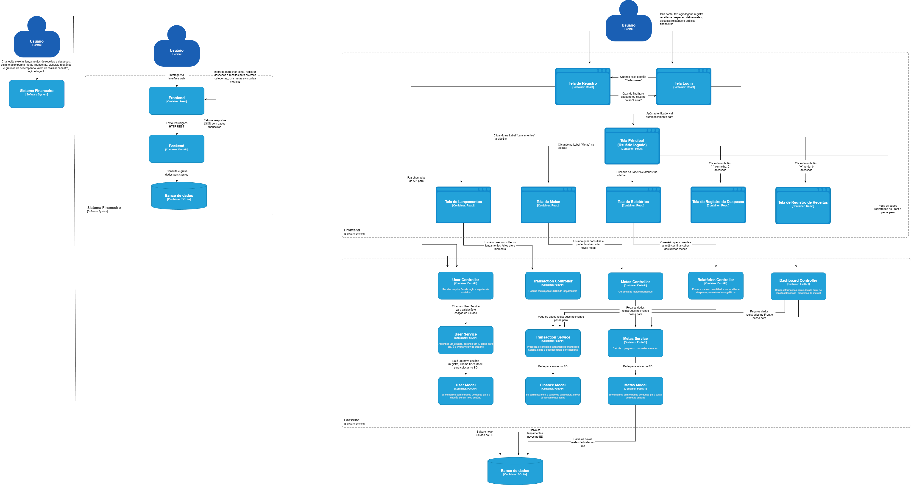

# Projeto de Organização Financeira (MC656)

O projeto consiste no desenvolvimento de um sistema digital voltado para auxiliar indivíduos no gerenciamento de suas finanças pessoais. A aplicação permitirá que o usuário cadastre seus gastos mensais, visualize a distribuição de despesas por meio de gráficos interativos e acompanhe a evolução de seu orçamento ao longo do tempo. Dessa forma, busca-se promover a educação financeira, incentivar o consumo consciente e contribuir para os Objetivos de Desenvolvimento Sustentável (ODS) 4 — Educação de Qualidade e ODS 8 — Trabalho Decente e Crescimento Econômico.

## Como Rodar o Projeto Localmente

### Pré-requisitos

- **Node.js:** Versão 22.18.0
- **Python:** Versão 3.13.7

### Backend

1. Navegue até a pasta do backend: `cd backend`
2. Crie e ative um ambiente virtual: `python -m venv venv` e `source venv/Scripts/activate`
3. Instale as dependências: `pip install -r requirements.txt`
4. Rode o servidor: `uvicorn main:app --reload`

### Frontend

1. Navegue até a pasta do frontend: `cd frontend`
2. Instale as dependências: `npm install`
3. Rode o servidor de desenvolvimento: `npm run dev`

## Avaliação A4

### Parte 1: Arquitetura

Para a avaliação A4, o estilo arquitetural adotado para o projeto é a arquitetura em camadas (Layered Architecture).

A aplicação é composta por três camadas principais:

- Model: Gerencia a lógica de negócios e a persistência dos dados. Essa camada inclui as entidades referentes a usuários, lançamentos financeiros, metas e categorias de receitas e despesas, armazenadas no banco de dados SQLite.

- Frontend: Responsável pela interação com o usuário, exibindo informações financeiras, gráficos e formulários por meio da aplicação React.

- Backend: Intermedia a comunicação entre o frontend e o banco de dados, processando as requisições HTTP, aplicando regras de negócio e retornando respostas em formato JSON.

### Características do Estilo Arquitetural em Camadas no nosso sistema

1. Divisão de Responsabilidades:

   - Frontend (React): Responsável pela interface e interação com o usuário, exibindo gráficos de desempenho, metas e lançamentos.
   - Backend (FastAPI): Processa as requisições, aplica as regras de negócio (como cálculos de metas e autenticação de usuários) e se comunica com o banco.
   - Model (SQLite): Armazena e recupera os dados relacionados a usuários, receitas, despesas e metas.

2. Encapsulamento:

   - O frontend não conhece a lógica de persistência de dados; apenas consome as APIs.
   - O backend não precisa conhecer detalhes da renderização ou da interface gráfica, apenas fornece os dados solicitados.

3. Modularidade e Reuso:

   - O módulo de autenticação de usuários pode ser reutilizado em outros sistemas FastAPI.
   - Os componentes gráficos do frontend podem ser integrados em diferentes dashboards ou aplicações analíticas.

### Principais Componentes e Suas Responsabilidades

Frontend (React):

- Página de Login: Permite que o usuário acesse o sistema com suas credenciais, verificadas pelo backend.

- Página de Registro: Caso seja um usuário sem credenciais cadastradas, consegue se cadastrar para realizar o acesso ao sistema.

- Página de Dashboards: Página inicial do sistema que permite o usuário ver as principais informações (saldo, total de receitas e despesas) para controle financeiro. Além disso, permite registrar novas receitas ou despesas de maneira rápida.

- Página de Lançamentos: Exibe todas as receitas e despesas do usuário, com a possibilidade de aplicação de filtros por data e categoria.

- Página de Metas: Permite cadastrar metas financeiras mensais e por categoria, e exibe o progresso em gráficos de pizza e barras.

- Página de Relatórios: Mostra gráficos de linha comparando receitas e despesas ao longo do tempo, oferecendo visão analítica da evolução financeira.

- Componentes Gráficos: Utilizam a biblioteca Recharts para representar visualmente os dados de forma intuitiva.

Backend (FastAPI):

- Rotas:

  - auth_controller.py: Gerencia o login e a autenticação dos usuários.
  - lancamentos_controller.py: Recebe e processa dados de lançamentos (criação, leitura, atualização e exclusão).
  - metas_controller.py: Controla o CRUD das metas financeiras e a verificação de progresso.
  - relatorios_controller.py: Gera dados analíticos para os gráficos do frontend.

- Services:

  - auth_service.py: Implementa a lógica de autenticação e geração de tokens JWT.
  - finance_service.py: Realiza os cálculos financeiros e agrega dados de receitas/despesas.
  - meta_service.py: Calcula o progresso das metas e identifica se foram atingidas ou ultrapassadas.

- Models:
  - User: Representa o usuário autenticado, com login, senha e permissões.
  - Lancamento: Representa transações financeiras (valor, tipo, data e categoria).
  - Meta: Representa metas mensais de receita e despesa.

Além disso, temos também o Banco de Dados (SQLite) que persiste as informações dos usuários como login, lançamentos financeiros e as metas definidas por ele.

### Padrão de Projeto

Optamos por utilizar o padrão de projeto Adapter no backend para permitir que o sistema trabalhe com múltiplas fontes de dados de forma transparente e organizada.
A responsabilidade de decidir de onde os dados serão obtidos (banco de dados ou arquivo JSON) foi centralizada na camada Adapter, evitando que essa lógica ficasse espalhada pelos serviços.

O funcionamento ocorre da seguinte forma:

- O Service solicita os dados ao Adapter, sem precisar saber a origem deles.
- O Adapter, com base em uma variável de ambiente (DATA_SOURCE), decide se deve buscar os dados no banco de dados ou em um arquivo JSON.

Essa abordagem facilita futuras extensões do sistema, por exemplo, permitir que o usuário importe um arquivo JSON com suas receitas e despesas (como um extrato bancário), sem depender do cadastro manual via API.
Dessa forma, o Adapter atua como uma camada intermediária entre as diferentes fontes de dados e a lógica de negócio, mantendo o código mais limpo, desacoplado e fácil de manter.

### Diagramas C4

Abaixo está o diagrama C4:

