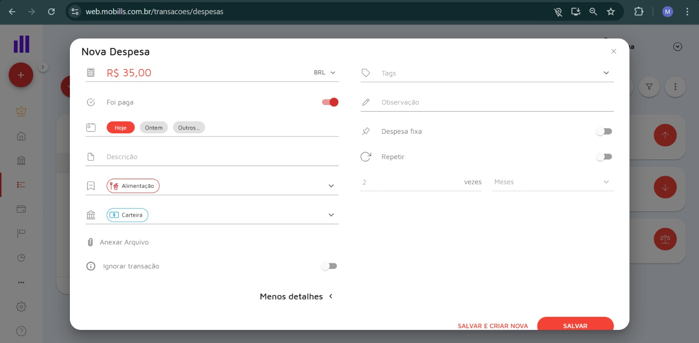

# **Elicitação de Requisitos**

Utilizamos duas técnicas de elicitação de requisitos: Brainstorming e Benchmarking

## **Benchmarking**

### **1. Mobills**

O Mobills é uma das aplicações de controle financeiro mais consolidadas no mercado brasileiro, com o objetivo de oferecer uma plataforma completa para o gerenciamento de finanças pessoais. Ele permite ao usuário centralizar o controle de suas contas, despesas, receitas e cartões de crédito em um só lugar.

#### **Pontos positivos**

- **Dashboard Intuitivo e Centralizador:** A tela inicial oferece uma visão geral da saúde financeira do usuário. Inclui um balanço mensal de receitas e despesas, além de gráficos de pizza que mostram a distribuição das transações por categoria, permitindo uma análise visual rápida. Há também um guia de "Primeiros passos" para novos usuários.

_Figura 1 – Dashboard inicial do Mobills_

_Figura 2 – Gráficos de Pizza e guia para novos usuários_

_Figura 3 – Balanço Mensal e fim da homepage_

- **Registro Detalhado de Transações:** O sistema oferece formulários completos e intuitivos para o cadastro tanto de novas receitas quanto de despesas. O usuário pode informar valor, data, categoria, conta, e status (pago/recebido), além de opções avançadas como anexo de arquivos e repetição de transações.

_Figura 4 – Cadastro de Receita_

_Figura 5 – Cadastro de Despesa_

- **Listagem e Controle de Lançamentos:** As receitas e despesas são listadas em tabelas claras e funcionais, que podem ser filtradas por mês. A interface inclui resumos rápidos (despesas pagas, receitas recebidas, total), facilitando o controle e a conferência dos dados registrados. A experiência do usuário é guiada por feedbacks visuais, como telas de sucesso após o cadastro e ilustrações para listas vazias.

_Figura 6 – Lista das Receitas_

_Figura 7 – Lista das Despesas_

#### **Pontos negativos**

- **Dashboard Inicial Poluído:** A tela inicial apresenta um excesso de informações, o que pode sobrecarregar o usuário. Apesar de permitir alguma personalização, o widget de "Primeiros passos", que ocupa um espaço considerável, não pode ser removido, prejudicando a otimização da visualização.

- **Visualização de Metas Pouco Intuitiva:** Verificamos que o aplicativo possui uma funcionalidade para estabelecer metas de gastos por categoria (orçamento). No entanto, a sua visualização é feita através de barras de progresso individuais para cada categoria. Essa abordagem dificulta ter uma visão consolidada e proporcional do orçamento total. Ao invés disso, a visualização poderia ser um gráfico de pizza e a visualização unificado em um só gráfico.

_Figura 8 – Lista da Meta de Gastos em Categorias (Orçamento)_

### **2. Organizze**

O Organizze é uma plataforma de controle financeiro desenvolvida para ajudar usuários a administrar melhor seu dinheiro de forma simples e intuitiva. Com ele, é possível registrar despesas, acompanhar receitas, planejar orçamentos e visualizar relatórios detalhados sobre a saúde financeira.

#### **Pontos positivos**

- **Informações Principais na Homepage:** A tela inicial oferece uma visão geral de sua situação financeira em segundos, sem a necessidade de navegar por múltiplos menus. Itens como receita, despesa, próximos valores a receber e a pagar, maiores despesas do mês e limites pré-definidos são essenciais para uma tomada de decisão rápida. Desta forma o usuário antecipa possíveis dificuldades financeiras, garantindo que sempre haja saldo para cobrir os gastos previstos e essenciais.

_Figura 9 – Homepage do Organizze_

_Figura 10 – Gráfico de Setores com Categorias de Maior Gasto_

  

- **Facilidade para Cadastrar Movimentações:** Além de dispor todas as principais informações na tela inicial, é de suma importância que o usuário consiga registrar movimentações financeiras de forma simples, prática e rápida. Os atalhos presentes na tela inicial facilitam esta interação.

_Figura 11 – Zoom no Atalho para Cadastro de Despesas e Receitas_

  

- **Personalização de Contas e Cartões:** A plataforma fornece grande possibilidade de personalização de nome e ícone. Para contas, abrange ícone de bancos, corretoras de investimento, fornecedores de ticket alimentação e lojas virtuais. Para cartões encontramos as principais bandeiras e fornecedoras de ticket alimentação também. Esta correspondência com a realidade contribui para a intuitividade de uso e facilidade de reconhecimento da origem dos gastos.

_Figura 12 – Ícones Disponíveis para Bancos e Cartões_

  
  

- **Personalização das Categorias de Despesa e Receita:** O sistema oferece personalização completa das categorias disponíveis para despesas e receitas, possibilitando a adição de categorias completamente novas, exclusão de categorias nativas, bem como personalização de ícone e cor. Esta possibilidade fornece total liberdade para o usuário adaptar os gastos de acordo com sua necessidade, imprescindínvel para facilitar a identificação das movimentações.

_Figura 13 – Personalização de Categorias_

  

- **Listagem e Controle de Lançamentos:** As receitas e despesas são listadas em uma única tabela clara e funcional, são agrupadas por dia de registro e podem ser filtradas por mês, categoria, contas, cartões e por tipo (receita ou despesa). A interface inclui um resumo rápido do saldo atual e previsto, facilitando o controle e a conferência dos dados registrados.

_Figura 14 – Lista das Lançamentos_

  

#### **Pontos negativos**

- **Falta do Balanço do Mês:** A tela inicial mostra informações como receitas e despesas no mês atual mas não informa o balanço (receitas - despesas). Esta informação é essencial para fazer com que o usuário perceba de forma rápida a quantia disponível de dinheiro para o restante do mês.

_Figura 15 – Receitas e Despesas_

  

_Figura 16 – Exemplo de Correção_

  

- **Pouca Opção de Personalização para Homepage:** O sistema permite que o usuário minimize e mova os blocos entre as colunas da esquerda e direita, mas não permite a exclusão/inclusão dos blocos informativos, por exemplo, não é possível remover o bloco de `Limite de gastos` mesmo que o usuário não deseje usar esta funcionalidade. Esta limitação atrapalha a visualização das informações que o usuário considera mais importante.

_Figura 17 – Homepage Não Personalizável do Organizze_

- **Mensagem de Erro Mal Comunicada:** Ao tentar criar uma receita/despesa sem criar uma conta ou cartão previamente o sistema informa que o campo é obrigatório, porém não há intruções claras para a criação de contas ou cartões. Poderia existir um atalho no próprio menu dropdown que levasse para a seção de criação de contas e cartões.

_Figura 18 – Mensagem de Erro_

  

- **Criação de Contas e Cartões:** A criação de contas e cartões é feita através da configuração da conta do usuário do sistema, escondido em um ícone no canto da tela. Existe um atalho para criar conta/cartão no bloco informativo correspondente, mas falta uma opção mais clara para isso. Poderia existir uma opção na barra de tarefas que levasse para a seção de criação de contas e cartões.

_Figura 19 – Seção para Criação de Contas_

